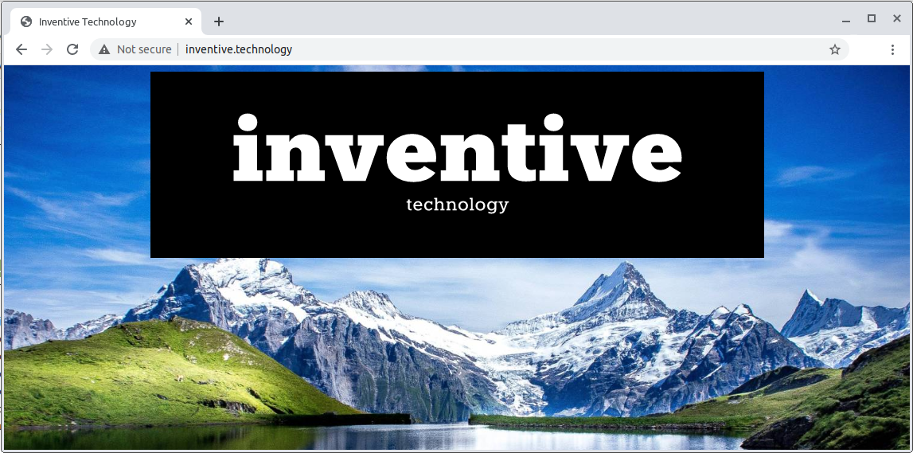
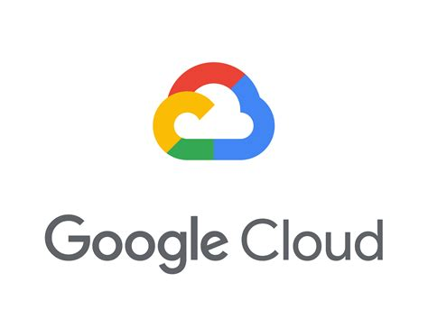
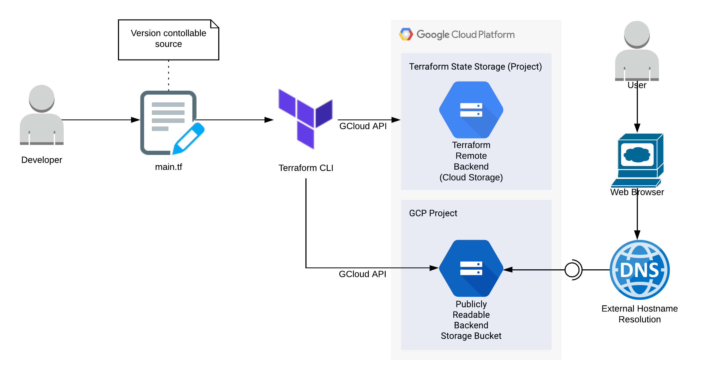
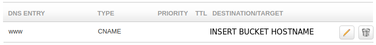

# Terraform GCP Static Website - Low Cost

Cloud Infrastructure as Code: Provisioning a Static Website from a Storage Bucket - a Minimalist Approach.
 
<p align="center"></p>

## Features

<p align="center"><a href="https://cloud.google.com/"></a><a href="https://www.terraform.io/"></a></p>

 - Similar functionality to [infrastructure-terraform-gcp-static-website](https://github.com/inventive-technology/infrastructure-terraform-gcp-static-website) but avoids Google Cloud Platform load balancing costs by providing the bare minimum of resources.
 - Provisions a simple static website in Google Cloud Platform.
 - A storage bucket serves up publicly readable files as web resources.
 - A small collection of files are provisioned as storage bucket objects:
    - index.html - a very basic landing page.
    - 404.html - presented when web resources are not found.
    - Background images, logo and favicon files.
 - A domain name registrar CNAME entry redirects to the storage bucket's public address.
 - This project builds upon other projects:
    - See [infrastructure-terraform-gcp-intro](https://github.com/inventive-technology/infrastructure-terraform-gcp-intro) for an overview of Terraform usage.
    - See [infrastructure-terraform-gcp-remote-backend](https://github.com/inventive-technology/infrastructure-terraform-gcp-remote-backend) which persists Terraform state data to a remote backend.

<p align="center"></p>

## Prerequisites

 - An installation of [Terraform CLI](https://learn.hashicorp.com/tutorials/terraform/install-cli)
 - A Google Cloud Platform account and installation of [Google Cloud SDK](https://cloud.google.com/sdk/docs/install)
 - A deployment of [infrastructure-terraform-gcp-remote-backend](https://github.com/inventive-technology/infrastructure-terraform-gcp-remote-backend), which provides the following required by this project:
    - A GCP project ID for the remote backend.
    - A storage bucket name for the remote backend.
    - A json key for a service account with Editor priviledge on the remote backend project.

## Getting Started

<details>
  <summary>Set up GCP project - click to expand.</summary>

 - Log into Google Cloud Platform create a new project and **copy** the project ID. This project will be separate from the project that provides the remote backend.
 
 - Edit the [main.tf](main.tf) and **paste** your project ID into the *project* line:

```
  project     = "place-project-id-here"
```

 - Within your GCP account for the selected project, under *IAM & Admin* find the *Service Accounts* section and create a GCP service account with the "Editor" priviledge. Export a json key for the service account and save it in the 'keys' sub-directory. See the [infrastructure-terraform-gcp-intro](https://github.com/inventive-technology/infrastructure-terraform-gcp-intro) project for detailed instructions.
 
 - Edit the [main.tf](main.tf) file and insert the file name of the exported json file into the *credentials* line, for example:

```
  credentials = file("my-project-key.json")
```

 - Edit the [main.tf](main.tf) file and configure the remote backend:
     - The *bucket* must match the name of the remote backend bucket created in the [infrastructure-terraform-gcp-remote-backend](https://github.com/inventive-technology/infrastructure-terraform-gcp-remote-backend) project.
     - The *credentials* must reference the service account json key for the terraform-state-storage project. Save this in the 'keys' sub-directory.
     - Setting *prefix* to the name of *this* project will provide a distinct sub-directory within the Terraform remote backend in which Terraform can store all state information.
 
```
terraform {
  backend "gcs" {
    bucket      = "terraform-remote-backend-xxxxxxxxxxxxxxxx"
    prefix      = "storage"
    credentials = "keys/terraform-state-storage-xxxxxx-xxxxxxxxxxxx.json"
  }
}
```

</details>

 - To create a public storage bucket, set the public bucket *name* and *origin* in main.tf to match the domain name you own. GCP won't allow you to create a storage bucket with the same name as your domain name without first verifying it. This process is straightforward and is [documented by GCP here](https://support.google.com/a/answer/183895?hl=en).
 
```
resource "google_storage_bucket" "public" {
  force_destroy = true
  name     = "place-domain-name-here"
...
    origin          = ["http://place-domain-name-here"]
```

 - Your domain name registrar's DNS settings will need to be set to point to the storage bucket's public address. With the domain name registrar *123-reg.co.uk* the DNS settings are under *manage DNS*:

<p align="center"></p>

 - A CNAME record will need to be added which points to the GCP storage bucket created by Terraform. The domain name used in this case was *www.inventive.technology* which required a CNAME record pointing to *http://www.inventive.technology.storage.googleapis.com*. 

<p align="center"></p>

<details>
  <summary>Set up Terraform - click to expand.</summary>

 - At the command line, in the root of this project you will need to initialise Terraform:

```
terraform init
```

 - You can then validate that the syntax of the Terraform configuration is correct by running:

```
terraform validate
```

 - To see what changes Terraform will need to apply, run:

```
terraform plan
```
 - Now we are ready to deploy the infrastructure, you will need to confirm with 'yes' when prompted:

</details>

```
terraform apply
```
 - The storage bucket and file resources should now exist within your GCP project. Additionally, the Terraform state will have been persisted to the remote backend in the terraform-state-storage GCP project.

 - Test whether the files are publicly available by going directly to the storage bucket's public address. For example, http://*your-bucket-name*.storage.googleapis.com/index.html.

 - DNS may take 24hrs to propagate. It should then be possible to access the static site from a browser using the domain name:
 
<p align="center"></p>

## Usage

```bash
terraform init
terraform validate
terraform plan
terraform apply
terraform show
terraform destroy
```

## Contributing
If you have any feedback/ideas open an issue and tell me what you think.

## References/Related Projects
 - [https://terraform.io](https://terraform.io)
 - [https://cloud.google.com](https://cloud.google.com)
 - [https://support.google.com/a/answer/183895?hl=en](https://support.google.com/a/answer/183895?hl=en) - verifying domain names with GCP
 - [https://github.com/inventive-technology/infrastructure-terraform-gcp-intro](https://github.com/inventive-technology/infrastructure-terraform-gcp-intro) - a basic introduction to Terraform/GCP
 - [https://github.com/inventive-technology/infrastructure-terraform-gcp-remote-backend](https://github.com/inventive-technology/infrastructure-terraform-gcp-remote-backend) - a prerequisite of *this* project